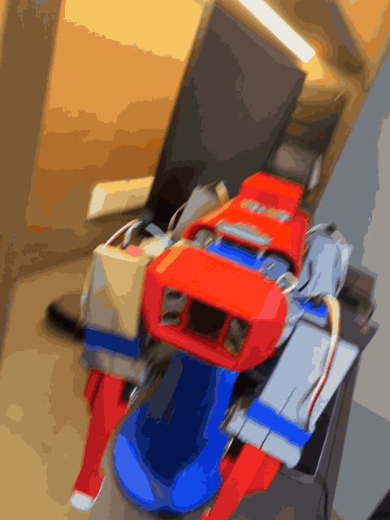
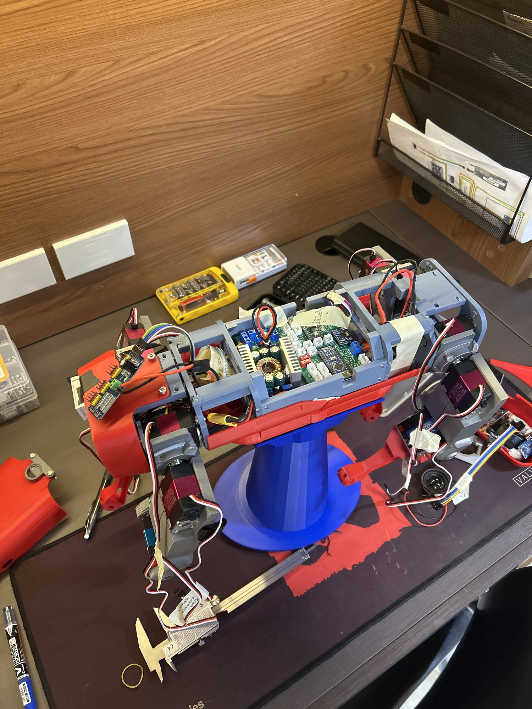
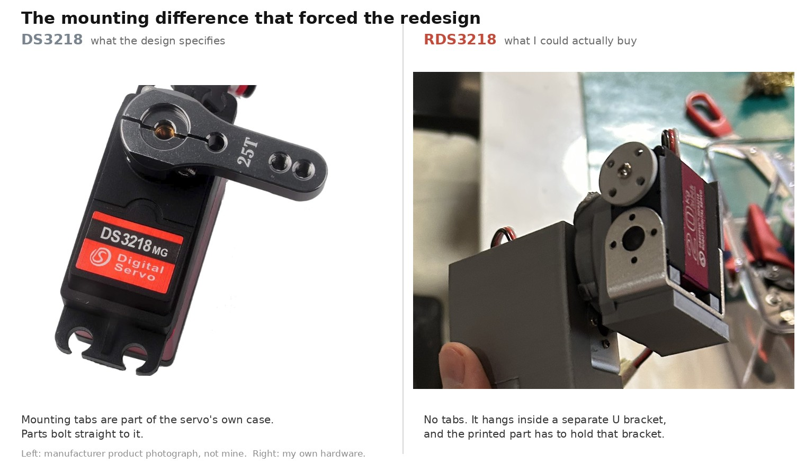
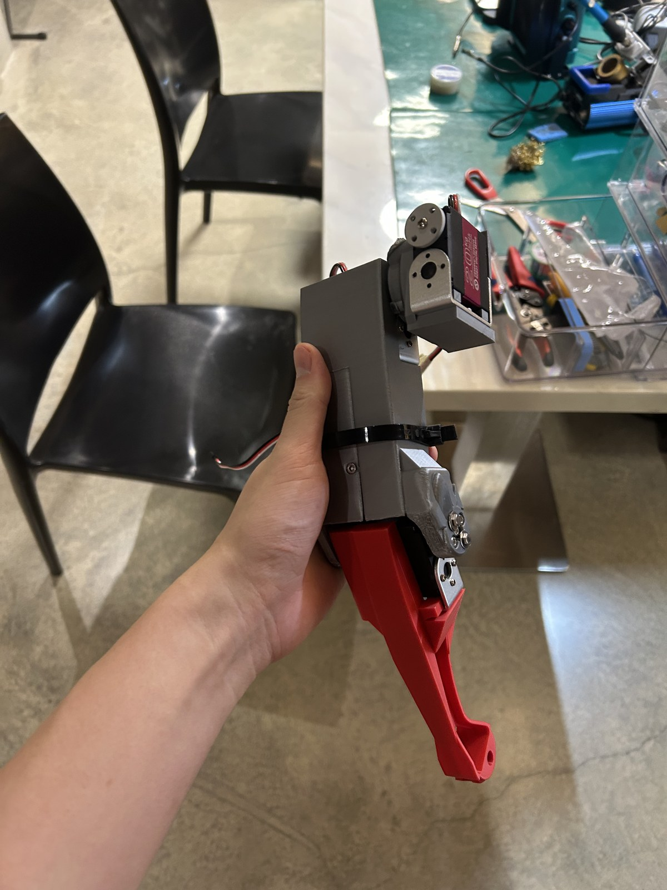
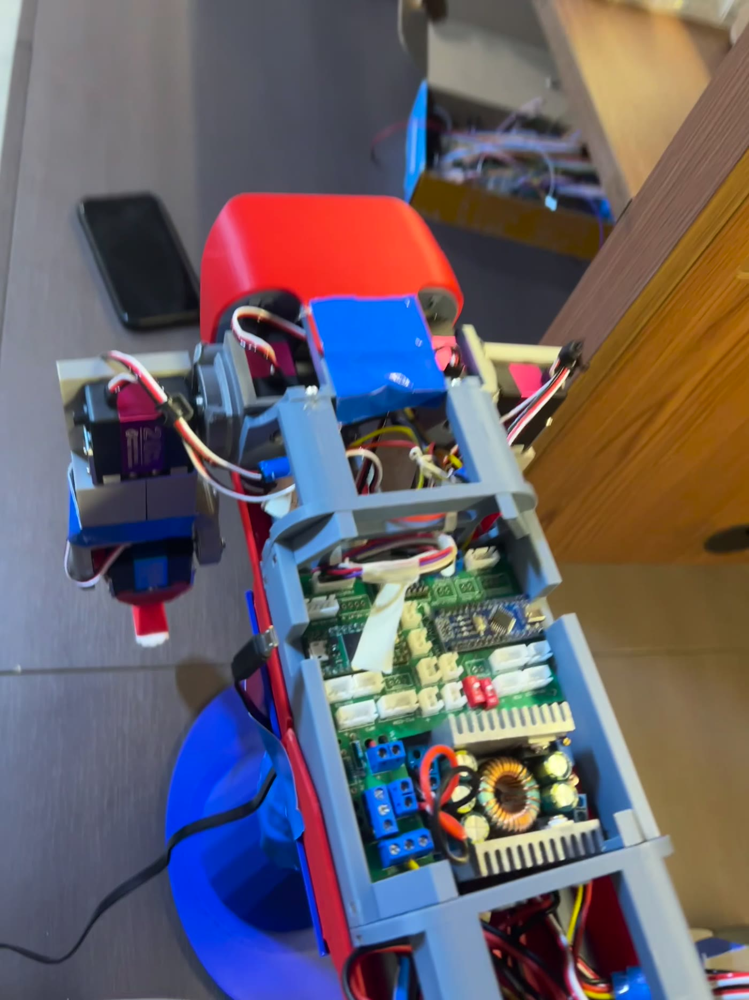
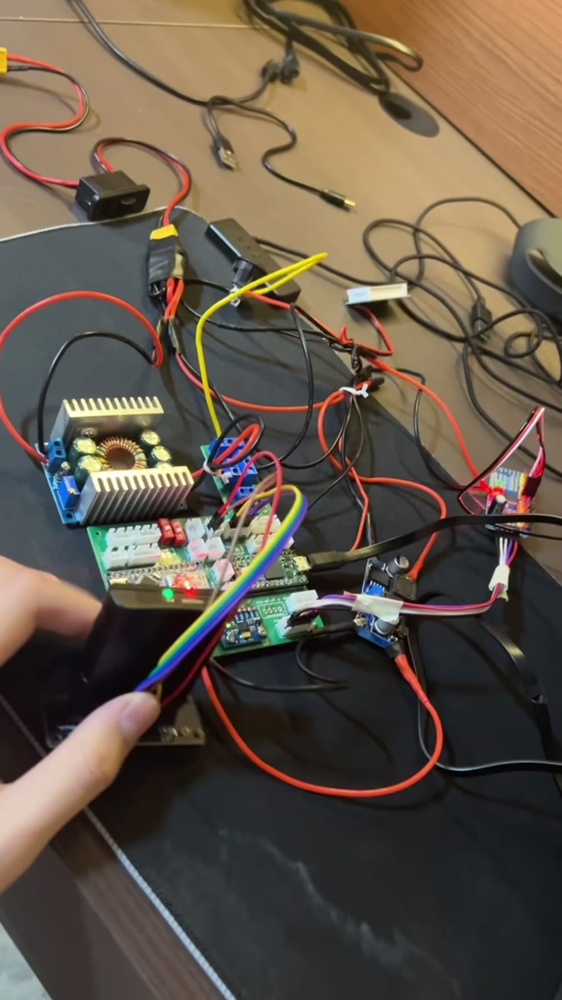

# Clifford: Mutated Spot Micro 3

<p align="center">
  
</p>

**Clifford is a twelve-servo quadruped robot.** He started as
[Chris Locke's Nova SM3](https://novaspotmicro.com), an open-source Spot-Micro-class
design, and he exists in this form because the servos that design is drawn around were
not available to me. Substituting them broke every leg part at once, so the legs were
redesigned from scratch around a different servo.

That is the project: **not a build of someone else's kit, and not a design of my own from
nothing, but the engineering in between.** Adapting a working system to parts it was never
meant to use, and getting it running again.



*Mid-integration on the bench. The grey coax and femur and the red tibia are my geometry.
The calipers in the corner are not set dressing: every part here was redrawn against
measurements.*

---

## The problem that started everything

I built this in the Philippines, where a significant share of the original bill of
materials was not practically sourceable. The servos were the ones that mattered.

The Nova SM3 is drawn around the **DS3218** servo, which bolts down through **four sets of
mounting holes.**

The only servos I could actually buy were the **RDS3218**, which does not have those holes.
It hangs in a **U-shaped metal bracket** instead.



That is not a tolerance problem you solve by opening a hole out by half a millimetre. The
mounting scheme every leg part was built around simply does not exist on the replacement
part. The pockets, the bosses and the screw features were all designed to grip something
that no longer had anything to grip.

So each leg part had to be redesigned from scratch around a completely different way of
holding a servo, while keeping the one thing that could not move: **the servo horn, which
is where the joint axis lives.** Move that and every link length changes, and the gait
tuning in the inherited firmware becomes meaningless.

**Twelve servos, all 270 degrees:** 8x RDS3218 at 20 kg.cm for the coax and femur joints,
4x RDS3235 at 35 kg.cm for the knees.

---

## What I changed

| | Chris Locke's | Mine |
|---|---|---|
| Robot concept, gaits, servo motion engine, master/slave architecture | all of it | |
| Original leg geometry | the starting point | **redesigned from scratch around the RDS3218 bracket** |
| Coax, femur and tibia parts | original | **mine**, horn interface preserved |
| Printing and assembly | | **mine** |
| Wiring diagram | v5.2b pictogram | **revised for parts I could source, plus one fault corrected** |
| Power distribution | cascaded converters | **reworked to parallel** |
| PCB assembly, wiring and bring-up | | **mine** |
| Per-subsystem bench test sketches | | **mine** |
| Firmware v4.2 to v5.1 | his | |
| Firmware v6.0 restructure | behaviour is his | **reorganisation is mine** |
| Servo calibration values | **still his**, and that is the open problem | see [Status](#status) |

---

## The engineering journey

<table>
<tr>
<td width="33%" valign="top">
<a href="mechanical/README.md"></a>
<br><b><a href="mechanical/README.md">Mechanical</a></b><br>
A servo that mounts in a bracket instead of through holes, and the three parts that had
to be redrawn because of it. Original against modified, measured from the meshes.
</td>
<td width="33%" valign="top">
<a href="electronics/README.md"></a>
<br><b><a href="electronics/README.md">Electronics</a></b><br>
A reference design that had gone stale, traced by hand against real hardware. Power
rework, a wiring fault, and one subsystem brought up at a time.
</td>
<td width="33%" valign="top">
<a href="firmware/README.md"></a>
<br><b><a href="firmware/README.md">Firmware</a></b><br>
6,390 lines in one file, 85 undocumented protocol strings, and an 812-line function.
Restructured into something maintainable, with two real bugs found on the way.
</td>
</tr>
</table>

---

## Status

Being straight about where this actually is:

| | |
|---|---|
| Leg redesign, printing, assembly | Complete |
| Electronics integration | Complete |
| Wiring diagram corrected and revised | Complete |
| Per-subsystem bench tests | Passing |
| PS2 receiver verified against live serial output | Yes |
| Firmware v6.0 restructure | Complete, compiles clean for both boards |
| **Servo recalibration for my servos** | **Not done** |
| **Walking** | **Not working yet** |

Those last two are one problem, and it is the most interesting open item in the project.

`NovaServos.h` still contains Chris Locke's `servoHome[]` and `servoLimit[]` values. I
checked: they are byte-identical to v5.1. Those numbers are physical measurements of *his*
robot, in raw PWM ticks, for *his* servos in *his* leg geometry. Mine has different servos,
with different travel, in legs I redrew. The numbers do not describe this machine, and the
gaits are hand-tuned against them, which is exactly why locomotion is the piece that does
not work.

The fix is not a code change. It is bench work with
[`Nova-SM3-calibrate/`](firmware/Nova-SM3-calibrate/) to re-measure home and limit
positions for all twelve joints, then re-tuning from there.

---

## Repository layout

```text
media/           hero photography and the walkaround clip
mechanical/      the leg redesign: CAD, comparisons, build photos
electronics/     wiring, power, PCB, bring-up
firmware/        the Arduino sketches and the v6.0 write-up
```

Chris Locke's original geometry lives in
[`mechanical/cad/original/`](mechanical/cad/original/) under his filenames and is never
edited in place. Keeping it intact beside mine is the only thing that makes either the
attribution or the comparison mean anything.

---

## Credit and licence

**Original project: Chris Locke** (`cguweb@gmail.com`).
[novaspotmicro.com](https://novaspotmicro.com) ·
[GitHub](https://github.com/cguweb-com/Arduino-Projects/tree/main/Nova-SM3) ·
[Thingiverse](https://www.thingiverse.com/thing:4767006) ·
[Instructables](https://www.instructables.com/Nova-Spot-Micro-a-Spot-Mini-Clone/).
MIT licensed, see [LICENSE](LICENSE), Copyright (c) 2021 Christopher M. Locke.

The robot, its gaits, its servo motion engine and its master/slave architecture are his.
The wiring diagram here is a revision of his v5.2b pictogram: the base artwork is his and
the revisions are mine.

**Third-party images.** The DS3218 photograph in the
[mechanical write-up](mechanical/README.md) is a manufacturer product image from a retail
listing, reproduced for comparison only. It is not my photograph.

**Third-party parts.** Thingiverse user **Ozzymat**'s
[Nova SM3 electronics-mounting remix](https://www.thingiverse.com/thing:7131451) (CC BY-SA)
was a reference for mounting the PCA9685 and the buck converter. Those parts are not
included here and are not my work.

**Leg redesign, electronics and v6.0 firmware restructure: Jeremy Aidan Yu.** The v6.0
restructure was done with Claude Code, which is stated here, in the firmware write-up and
in the source headers.
