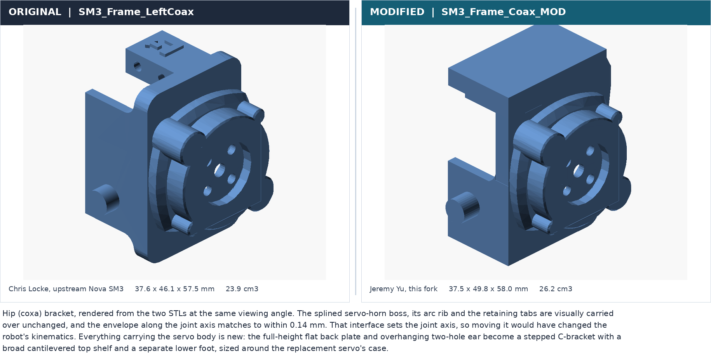
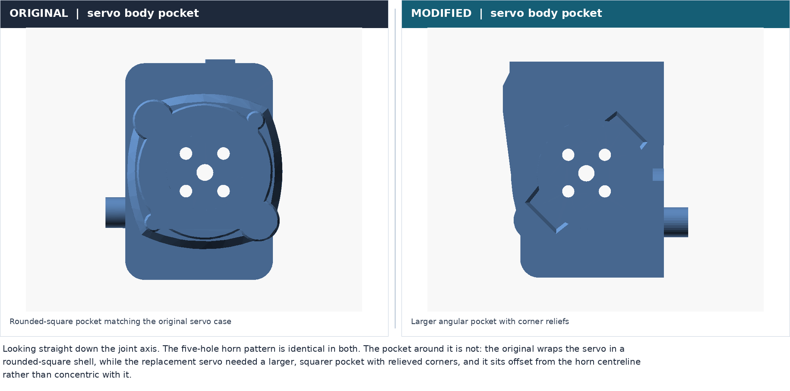
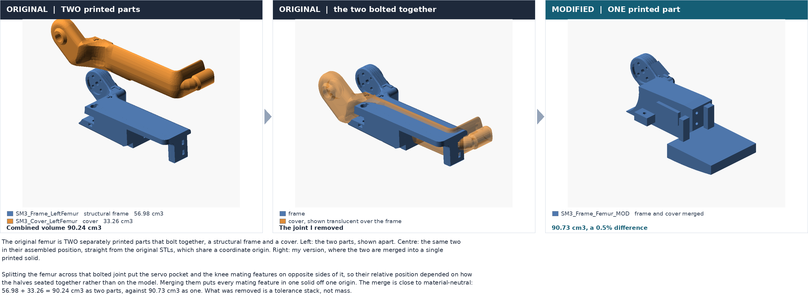
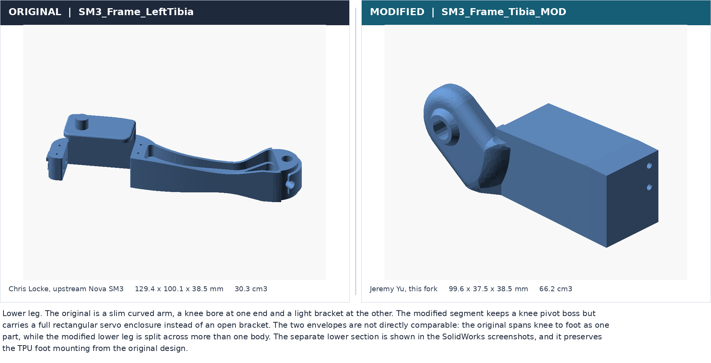
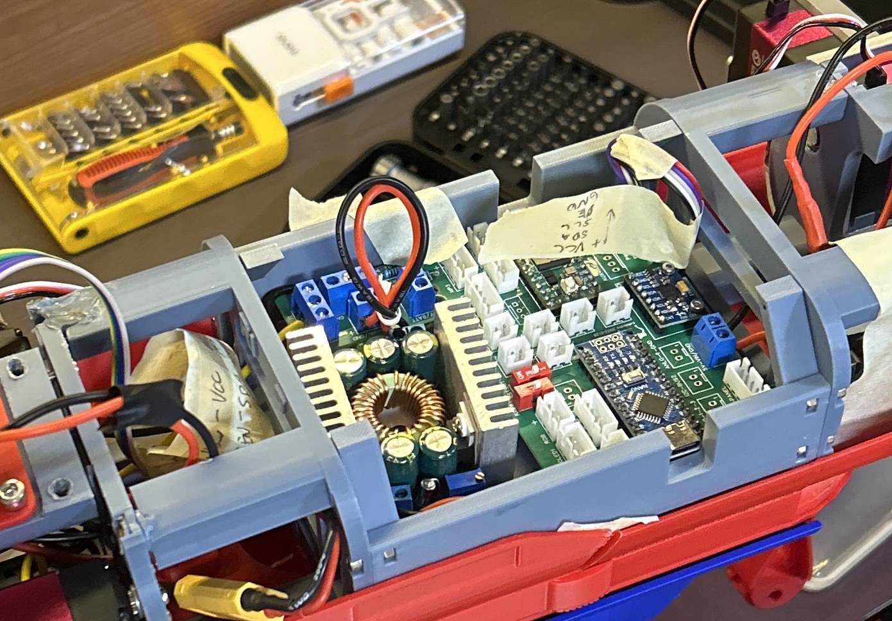

# Modded Nova SM3 ("Clifford")

A twelve-servo quadruped robot, built from [Chris Locke's Nova SM3](https://novaspotmicro.com)
design and then substantially re-engineered because I could not buy the parts it
specifies.


*Clifford on the bench during electronics integration. Grey and red parts are my
prints; the leg segments top and bottom are my redesigned geometry. Note the buck
converter (green board, toroidal inductor), the controller PCB, the labelled wiring,
and the calipers. The redesign was measurement-driven.*

---

## My role, in one paragraph

**This is not my design.** The Nova SM3, its architecture, its gaits, its servo motion
engine and its master/slave split, is Chris Locke's work, and the firmware in this repo
is his code. What is mine is everything that had to change when the specified hardware
turned out to be unavailable where I live: **I redesigned the coax, femur and tibia leg
parts around servos with different mounting geometry, merged the two-piece femur into a
single printed part to fix its mating tolerances, printed and assembled the whole robot,
re-architected the power distribution and corrected a wiring fault in the reference
design, brought each subsystem up individually with test sketches I wrote, and
reorganised 6,390 lines of inherited firmware into something maintainable.** The robot
stands, the electronics work, and the controller talks to the servos. It does not yet
walk.

---

## The constraint that drove everything

I built this in the Philippines. A significant share of the components in the original
bill of materials were not practically sourceable locally, and the servos were the ones
that mattered.

Servos are not interchangeable. Swapping to a different servo changes:

- the **body dimensions**, so every pocket and bracket that captures the case is wrong;
- the **mounting hole pattern**, so every screw boss is wrong;
- but *not* necessarily the **output horn spline**, which is the one thing that must not
  move, because it defines each joint's axis and therefore the robot's kinematics.

So the redesign had a clear rule: **preserve the horn interface exactly, rebuild
everything around it.** That rule is visible in every comparison below.

---

## What I changed, and what I didn't

| Area | Chris Locke's | Mine |
|---|---|---|
| Robot architecture, gaits, `AsyncServo` motion engine, master/slave I2C protocol | all of it | |
| Original STL geometry | yes | used as the base body, then modified |
| **Coax, femur and tibia geometry** | original geometry | **redesigned around replacement servos** |
| **Femur as a two-piece frame + cover** | two printed parts | **merged into one printed part** |
| Printing and assembly of the whole robot | | **mine** |
| **Power distribution architecture** | cascaded converters | **reworked to parallel** |
| **Wiring diagram** | v5.2b pictogram | **revised for the parts I could source** |
| PCB assembly, wiring and bring-up | | **mine** |
| Per-subsystem bench test sketches (`Code/Tests/`) | | **mine** |
| Firmware v4.2 to v5.1 | his | |
| **Firmware v6.0** (restructure, documentation, 2 bug fixes) | behaviour is his | **reorganisation is mine** |
| Servo calibration values | still his | see [Status](#status) |

---

## Mechanical redesign

Every figure below is rendered directly from the actual STL files in
[`hardware/cad/`](hardware/cad/), original and modified, at matched camera angles.
Dimensions and volumes are measured from the mesh geometry, not estimated.

### Coax (hip) bracket



The servo-horn boss, its arc rib and the retaining tabs carry straight over, and the
envelope along the joint axis matches to within **0.14 mm**. Everything that holds the
servo body is new: the original's full-height back plate and overhanging two-hole ear
become a stepped C-bracket with a cantilevered top shelf and a separate lower foot.



Looking straight down the joint axis makes the point cleanly: **same five-hole horn
pattern, different pocket.**

### Femur: two parts merged into one



In the original design the femur is **two separately printed parts that bolt together**,
a structural frame and a cover. The figure shows them apart, then in their assembled
position (both original STLs share a coordinate origin, so that centre view is the real
fit, not an arrangement I posed), then my version, where the two are **merged into one
printed solid**.

Splitting the femur across that bolted joint put the servo pocket and the knee mating
features on opposite sides of it, so their relative position depended on how the halves
seated together rather than on the model. With a replacement servo already forcing new
pocket geometry, that was one variable too many: the dimensions and the mating
connections had to be right by construction. Merging them puts every mating feature in
one solid, referenced off one origin.

The merge is close to material-neutral: **56.98 + 33.26 = 90.24 cm3 as two parts,
against 90.73 cm3 as one, a difference of 0.5%.** What was removed was a tolerance
stack, not mass.

### Tibia (lower leg)



→ **Full walkthrough: [`docs/mechanical-redesign.md`](docs/mechanical-redesign.md)**

---

## Electronics



*The controller PCB hand-populated with servo headers, Nano and IMU, beside the
step-down converter, and my own masking-tape labels marking `+VCC / SDA / SCL / OE /
GND` so the I2C and output-enable lines could be traced during bring-up.*

I could not source the specified converters or several peripherals, so the power tree
and parts of the signal wiring had to be reworked. That work is captured in a **revised
wiring diagram** with its changes listed on the drawing itself:


→ **Full diagram: [`hardware/electronics/Wiring_NovaSM3_v5-2b_MOD.png`](hardware/electronics/Wiring_NovaSM3_v5-2b_MOD.png)**
(6000 x 4712; open it full size to read the pin labels)

The two that are real engineering rather than substitution:

**Power: cascaded converters reworked to parallel.** In the reference design the XL6009
5.4 V converter took its input from the 6.8 V converter's output block, so the two ran
in series and everything downstream of the first inherited its droop and its losses.
Under twelve servos this is exactly the arrangement you do not want. I moved the XL6009
input off that block and onto the switched battery pair at the 6.8 V buck input, so
**both converters now run in parallel off the pack**, and the change freed a VIN and a
GND terminal.

**A wiring fault in the reference design.** The PIR ground drop dead-ended on the
`VIN PIR, PS2, SW` **+5 V rail** rather than the ground rail. I traced it, corrected it,
and redrew the four remaining +5 V / GND crossings as explicit over-under so the drawing
cannot be misread as a connection.

The **NRF24L01 was removed and a Yahboom 2.4 G PS2 receiver fitted** in its place on the
PS2-COM header, with VCC on 3.3 V, and the shared D9/D10 lines mean the NRF footprint
must stay unpopulated. The DFPlayer Mini was replaced by a DFPlayer PRO (DFR0768).

Bring-up was done **one subsystem at a time** using
[`Code/Tests/`](Nova-SM3/Code/Tests/), eight standalone sketches that deliberately
include none of the main firmware, so a pass isolates a wiring fault from a firmware
fault.

→ **Details: [`docs/electronics.md`](docs/electronics.md)**

---

## Firmware

The inherited firmware worked but was hard to change: the Teensy master was a single
**6,390-line `.ino`**, with an 812-line `ps2_check()` nested eight levels deep, a
425-line `setup()`, and 85 undocumented magic strings like `"MQNOFzn"` as the I2C
protocol between the two boards.

I produced **v6.0**: the same robot, reorganised.

| | v5.1 (inherited) | v6.0 (mine) |
|---|---|---|
| Teensy sketch | one 6,390-line file | 12 topical tabs, largest 886 lines |
| Largest function | `ps2_check()`, 812 lines, 8 deep | `follow()`, 215 lines |
| `setup()` | 425 lines | 19 lines, one call per boot step |
| Slave protocol | 85 undocumented strings | named constants in a shared header |
| Nano flash used | 91% | 83% |

Behaviour is deliberately unchanged, and that was verified rather than assumed: the
slave-protocol renaming and the file split both produced **byte-identical compiler
output**. Two genuine defects surfaced while reading and were fixed: a button-release
handler that tested `PSB_R2` where it meant `PSB_R1` (so releasing R1 never stopped the
body roll), and three ultrasonic debug prints where only the first was behind its debug
guard.

**On the controller.** Upstream's newer versions, and the v5.2b board this build is
based on, are designed around an nRF24L01 plus a custom-built remote; upstream's older
versions used a PS2 controller. Rather than fabricate a bespoke remote, I **removed the
NRF24L01 and wired a PS2 receiver in its place** (revision 3 on the wiring diagram) and
built the firmware on the older PS2 code path. That is why v6.0 is, as my own source
header puts it, a "Frankenstein": v5.1's structure with the PS2 control path retained.

**On AI assistance.** The v6.0 restructure was done with Claude Code, and I have said so
in the firmware README, in the source headers, and here. The refactor was mine to
direct, review and verify.

→ **Full changelog: [`Nova-SM3/Code/README.md`](Nova-SM3/Code/README.md)**

---

## Status

| | |
|---|---|
| Mechanical design and printing | Complete |
| Assembly | Complete |
| Electronics integration | Complete |
| Wiring diagram revised for sourced parts | Complete |
| Per-subsystem bench tests | Passing |
| PS2 controller to servo path | Verified |
| Firmware v6.0 restructure | Complete, compiles clean for both target boards |
| **Servo recalibration for my servos** | **Not done** |
| **Walking gaits on this robot** | **Not working yet** |

The last two are the same problem, and it is worth being clear about it because it is
the most interesting open item in the project.

`NovaServos.h` still contains **Chris Locke's `servoHome[]` and `servoLimit[]` values,
byte-for-byte.** Those numbers are physical measurements of *his* robot: raw PWM ticks
for his servos in his leg geometry. Mine has different servos in legs I redesigned, so
those values do not describe this machine. The gaits are hand-tuned against them, which
is why locomotion is the piece that does not work yet. The fix is not a code change. It
is bench work with [`Nova-SM3-calibrate/`](Nova-SM3/Code/Nova-SM3-calibrate/) to
re-measure home and limit positions for all twelve joints, then re-tuning from there.

---

## Repository layout

```text
README.md                       this file
docs/
  mechanical-redesign.md        how the leg parts were modified, and why
  electronics.md                power, wiring, bring-up and debugging
hardware/
  cad/
    original/                   Chris Locke's unmodified reference STLs
    modified/                   my geometry, STL plus native SolidWorks parts
    comparisons/                rendered before/after figures
    README.md                   which file is whose, with measured dimensions
  electronics/                  revised wiring diagram
  media/                        build photography
Nova-SM3/Code/                  the firmware (see its own README)
```

**`hardware/cad/original/` is never overwritten.** Keeping Chris Locke's geometry intact
next to mine is the only way either the attribution or the comparison means anything.

---

## Credit and licence

**Original project, Chris Locke** (`cguweb@gmail.com`) ·
[novaspotmicro.com](https://novaspotmicro.com) ·
[GitHub](https://github.com/cguweb-com/Arduino-Projects/tree/main/Nova-SM3) ·
[Thingiverse](https://www.thingiverse.com/thing:4767006) ·
[Instructables](https://www.instructables.com/Nova-Spot-Micro-a-Spot-Mini-Clone/).
MIT licensed, see [LICENSE](LICENSE), Copyright (c) 2021 Christopher M. Locke.
The wiring diagram here is a revision of his v5.2b pictogram; the base artwork is his
and the revisions are mine.

**Third-party parts.** Thingiverse user **Ozzymat**'s
[Nova SM3 electronics-mounting remix](https://www.thingiverse.com/thing:7131451)
(CC BY-SA) is in my working files as a reference for mounting the PCA9685 and the
XL6009 buck converter. Those parts are **not** included here and are **not** my work;
the geometry documented as mine is the coax, femur and tibia only.

**Modifications, mechanical redesign, electronics and v6.0 firmware, Jeremy Aidan Yu**,
with the v6.0 restructure done with assistance from Claude Code.
