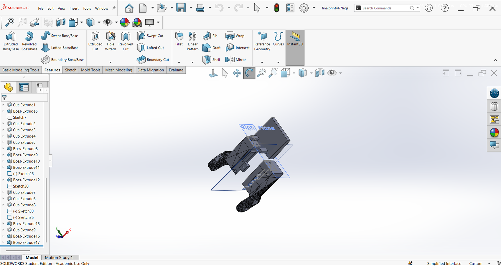

# Mechanical redesign

How the Nova SM3 leg parts were adapted for servos the original design was never drawn
around.

← [back to the main README](../README.md)

---

## The problem

The Nova SM3 bill of materials specifies particular servos. I could not practically
source them, so I bought what was available.

The replacement servos have a different case size and a different mounting hole pattern.
Every part that touches a servo is therefore wrong: the pocket that captures the case,
the bosses the screws land in, and the clearance around the whole assembly.

What is *not* necessarily wrong is the **output horn**. If the replacement servo's horn
spline and its bolt circle match, then the point where the servo's rotation enters the
mechanism can stay exactly where the original put it.

That distinction is the whole design.

---

## The rule

> **Preserve the horn interface exactly. Rebuild everything around it.**

The horn interface is where the joint axis lives. Move it by a few millimetres and every
link length in the leg changes, which means the gait tuning in
[`Gaits.ino`](../Nova-SM3/Code/Nova-SM3_teensy-v6.0/Gaits.ino), hundreds of hand-tuned
multipliers arrived at on real hardware with no inverse kinematics to fall back on,
becomes meaningless.

Everything else is just structure. Structure can be rebuilt.

---

## How the parts were actually modified

Not redrawn from scratch, and not edited as meshes either. The workflow was:

1. **Import the original STL into SolidWorks as a base solid body.** This appears in the
   feature tree as `Imported1`.
2. **Cut away** the geometry that assumed the original servo: pockets, bosses, brackets.
3. **Add native parametric features**, sketches, boss-extrudes and cut-extrudes, for the
   replacement servo.
4. **Mirror** where a left/right pair is needed, and lay parts out on a print plate.

You can see this directly in the feature trees:

<table>
<tr>
<td width="50%"></td>
<td width="50%"></td>
</tr>
<tr>
<td colspan="2"><em>Left: the coax part. The tree starts with <code>Imported1</code>, Chris Locke's STL, and then carries my own <code>Sketch2/4/7</code>, <code>Boss-Extrude1/4/5/11-15</code> and <code>Cut-Extrude1</code> on top of it. Right: the femur part, with roughly twenty-five sketch and feature operations. This is why the modification is parametric and re-editable rather than a one-way mesh edit.</em></td>
</tr>
</table>

This matters practically as well as for provenance: because the changes are parametric
features on an imported body, a different servo can be accommodated by editing a sketch
dimension rather than starting again.

---

## Part by part

All dimensions below are **measured from the mesh geometry** of the files in
[`../hardware/cad/`](../hardware/cad/), not estimated or recalled.

### Coax (hip) bracket

| | Original `SM3_Frame_LeftCoax` | Modified `SM3_Frame_Coax_MOD` | Delta |
|---|---|---|---|
| Envelope | 37.59 x 46.13 x 57.50 mm | 37.45 x 49.77 x 57.97 mm | +3.64 mm across |
| Volume | 23.88 cm3 | 26.21 cm3 | +9.8% |

The axis-direction envelope changes by **0.14 mm**. That is the interface being held.
The 3.64 mm growth is all transverse, which is the pocket opening up for a wider servo
case.

Structurally, the original's full-height flat back plate with an overhanging two-hole
ear becomes a stepped C-bracket: a narrow vertical web, a broad cantilevered top shelf,
and a separate lower foot with a boss.

Down the joint axis, the five-hole horn pattern is identical between the two parts. The
pocket is not: rounded-square and concentric in the original, larger and angular with
relieved corners and offset from the horn centreline in mine.

### Femur: two parts merged into one

This is the change I am most pleased with, and it is not a servo accommodation. It is a
tolerance decision.

**In the original design the femur is two separately printed parts** that bolt together:

| Original part | Envelope | Volume |
|---|---|---|
| `SM3_Frame_LeftFemur` (structural frame) | 138.54 x 44.47 x 34.66 mm | 56.98 cm3 |
| `SM3_Cover_LeftFemur` (cover) | 156.79 x 55.47 x 40.45 mm | 33.26 cm3 |
| **Total as an assembly** | | **90.24 cm3** |

**I merged them into a single printed part:**

| Modified part | Envelope | Volume |
|---|---|---|
| `SM3_Frame_Femur_MOD` | 147.13 x 68.49 x 35.66 mm | **90.73 cm3** |

**Why.** Splitting the femur across a bolted joint puts the servo pocket and the knee
mating features on opposite sides of that joint. Their relative position is then set by
how the two halves seat against each other, which depends on print tolerance, warp and
fastener preload, rather than by the model. With a replacement servo already forcing new
pocket geometry, that stack was one variable too many: the dimensions and the mating
connections needed to be right by construction, not by assembly.

Merging them puts every mating feature in one solid, referenced off a single origin. The
knee mate and the servo pocket cannot drift relative to each other because there is no
longer a joint between them.

**What it cost.** Almost nothing in material: **90.24 cm3 as two parts against 90.73 cm3
as one, a difference of 0.5%.** What was removed was an assembly joint and its tolerance
stack. The tradeoff is print orientation, since one larger part has fewer good
orientations than two smaller ones, and reduced serviceability, because the cover no
longer comes off independently.

The hip-end servo-horn hub is preserved throughout, and the knee end is rebuilt around
the replacement servo.

> **On the evidence.** The two-into-one merge is my own account of the design intent.
> What this repository independently shows is that the modified femur carries the
> original frame's horn hub and profile with the cover's enclosed volume added, and that
> the volumes agree to within 0.5%. Both are consistent with the merge.

### Tibia (lower leg)

| | Original `SM3_Frame_LeftTibia` | Modified lower-leg segment | Delta |
|---|---|---|---|
| Envelope | 129.35 x 100.09 x 38.48 mm | 99.64 x 37.52 x 38.52 mm | see note |
| Volume | 30.27 cm3 | 66.15 cm3 | +118% |

The original tibia is a slim curved arm, a knee bore at one end and a light bracket at
the other. The modified segment keeps a knee pivot boss but carries a **full rectangular
servo enclosure** where the original had an open bracket, which is where the doubled
volume comes from.

The envelope numbers are not directly comparable, because the original tibia is a single
part spanning knee to foot while the modified lower leg is split across more than one
body. The separate lower section carries the **TPU foot mounting** through from the
original design:

*The lower tibia section, with the tapered foot end that takes the TPU foot. The foot
mounting was preserved deliberately: the TPU feet were one of the few original
components I could still use.*

---

## About the print plate

`SM3_Frame_FemurTibia_MOD_PrintPlate.stl` is the file that was actually printed, and it
holds **two separate solid bodies**, the femur and the tibia, laid out on one plate:

| Body | Triangles | Envelope | Volume | Is |
|---|---|---|---|---|
| 1 | 5,370 | 147.13 x 68.49 x 35.66 mm | 90.73 cm3 | femur (frame + cover merged) |
| 0 | 5,608 | 99.64 x 37.52 x 38.52 mm | 66.15 cm3 | tibia, lower leg segment |

`SM3_Frame_Femur_MOD.stl` and `SM3_Frame_Tibia_MOD.stl` are those two bodies separated
out so each can be used on its own. The geometry is untouched; only the file container
differs. The comparison figures use the separated bodies so each is measured against the
correct original part.

## What is not documented here

Being explicit, because a portfolio that only shows the parts that went well is not
worth much:

- **No dimensioned drawings.** The comparisons are rendered geometry and measured
  envelopes, not a formal drawing package with tolerances.
- **No modified tibia STL export.** The lower tibia section is evidenced by SolidWorks
  screenshots only; it was not exported as a standalone STL into the archived set.
- **No print settings or material record.** Layer height, infill, material and
  orientation were not logged, and I am not going to reconstruct them from memory.
- **No load analysis.** Parts were sized by judgement and iteration, not by FEA or
  measured joint torque.
- **Which specific servos.** I have not recorded the exact model of the replacement
  servos anywhere in this repository, which in hindsight is the single most useful thing
  I could have written down.
