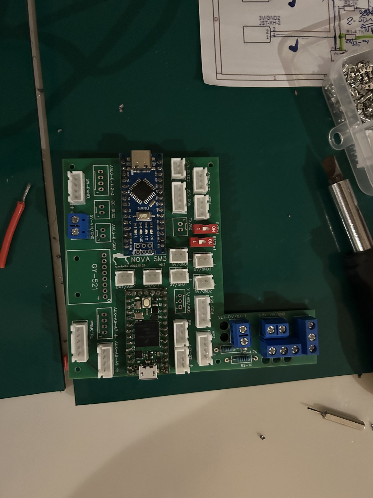
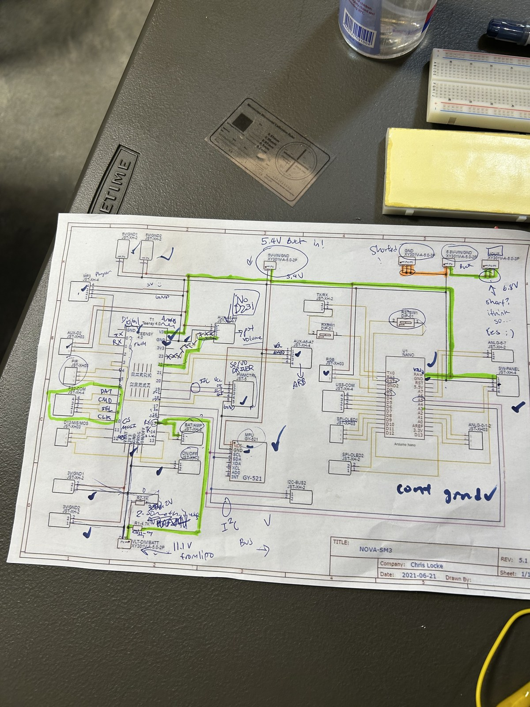
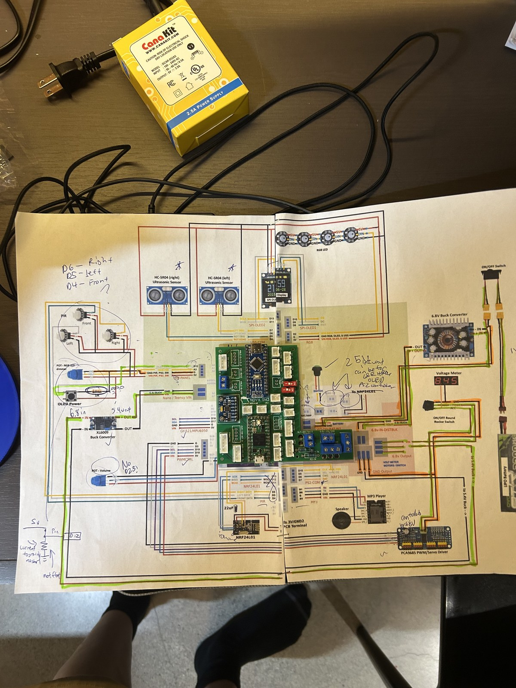
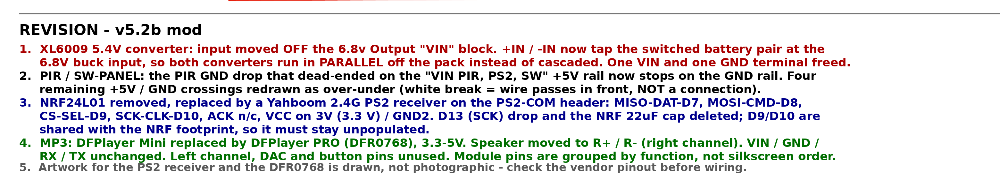
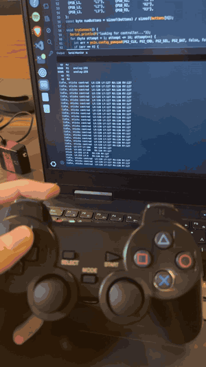

# Electronics: wiring a reference design that had gone stale

← [back to the main README](../README.md)

---

## What is actually inside

Before any diagrams, this is the real thing:

*Looking down into the open electronics bay of the assembled robot. The controller PCB is
at the bottom of the frame with the servo harnesses running out to the legs, and the
step-down converter sits above it. I hadn't soldered initensively before, I soldered everything here (PCB, MCUs, XT60 connectors) and tested connections.*

<table>
<tr>
<td width="50%"></td>
<td width="50%"></td>
</tr>
<tr>
<td colspan="2"><em>Left: the Nova SM3 controller board after I populated and soldered it,
before installation. It is the Chris' project's own PCB (which I had to adopt by rerouting components), not an off-the-shelf module: JST servo
headers, an Arduino Nano, an MPU6050 breakout, a DIP switch and screw terminals. Right: the
same board fitted in the chassis beside the converter. The masking-tape labels reading
<code>+VCC / SDA / SCL / OE / GND</code> are mine, written during bring-up so the I2C and
output-enable lines could be traced against the drawing without counting pins every
time.</em></td>
</tr>
</table>

**What has to be powered:** twelve servos, two microcontrollers, an IMU, three PIR sensors,
two ultrasonic sensors, an OLED, four addressable RGB LEDs, an MP3 player and a speaker,
all from one LiPo pack. 

---

## The pictogram was wrong. The schematic is what proved it

The upstream project ships two wiring documents, a **schematic** and a **pictogram**, and
they do not agree with each other. The schematic is accurate. The pictogram belongs to an
older, deprecated revision, and following it as drawn does not give you a working robot.

*Chris Locke's REV 5.1 schematic, printed and used as a live test sheet. This is the
drawing that held up under testing, which is why it became my reference. Blue ticks are
nets I confirmed with a multimeter, green highlighter follows the ones I was chasing to get an understanding of the structure, the
PS2-COM header is hand-labelled DAT / CMD / SEL / CLK because that mapping had to be worked
out, and `cont gnd` with a tick at the bottom records ground continuity confirmed. I did this by doing a disjoint set union approach for continuity.
The ports for grounds werenodes, the traces between them are edges, just run DSU and make sure everything is continuous!*

*The v5.2b pictogram, traced in highlighter along the power path with pen notes throughout*

I found quite a few errors, some by tracing and some by physical building and realising things didnt turn on consistently.
The output of all of this is a **corrected pictogram**, which carries its own
revision block that also shows my modifications:

> ## [Open the full corrected wiring diagram](wiring/wiring-diagram-modified.png)
>
> `electronics/wiring/wiring-diagram-modified.png`, 6000 x 4712. Every pin is labelled and
> every revision is marked on the sheet. This is the drawing to build from.

The base artwork is Chris Locke's. The revisions and the revision block are mine. It is
committed as the drawing itself rather than redrawn or summarised, so the documentation and
the artifact cannot drift apart the way the upstream pair did.

---

## Revision 1: cascaded converters reworked to parallel

**The symptom.** Startup was inconsistent. When I connected the ps2 controller and the servo driver to the pcb
while powering it, it would inconsistently start up. MCUs would not even power sometimes.
However if I didn't plug them in or plugged them in hot, these components would turn on.

**The hypothesis.** - one thing that I could see for sure is that there was a consistent **inconsistent** start up problem. When I put the 
ps2 controller and servo driver it would have a hard time starting up despite drawing only very little amps (don't remember the number).
I thought there could be some **impedance** problem between the bucks and all components: testing with multi meter I saw the 6.8V buck converter sagged 
causing the voltage down stream to sag as well. 

**What the reference design did.** The XL6009 5.4 V converter took its input from the
**6.8 V converter's output block**. The two converters therefore ran **in series**.

**The fix.** I moved the XL6009 input **off** the 6.8 V output block and onto the switched
battery pair at the 6.8 V buck input. **Both converters now run in parallel off the pack**,
so neither sees the other's output impedance.

> Revision 1, in the drawing's own words: *"XL6009 5.4V converter: input moved OFF the 6.8v
> Output 'VIN' block. +IN / -IN now tap the switched battery pair at the 6.8V buck input, so
> both converters run in PARALLEL off the pack instead of cascaded. One VIN and one GND
> terminal freed."*

## Revision 2: the PIR short

This is the fault that made the exercise worth doing. On the pictogram, **the PIR ground
drop terminated on the `VIN PIR, PS2, SW` +5 V rail** instead of the ground rail.

Wired as drawn, that ties a ground return straight to a +5 V rail, which is a short across
the sensor supply.

So I fixed it. I mentioned the changes I wanted to claude and it ran the photoshop for me.

## Revisions 3 to 5: component substitutions

| Original | What I fitted | Consequence |
|---|---|---|
| NRF24L01 plus a custom-built remote | **Yahboom 2.4 G PS2 receiver** | On the PS2-COM header: MISO-DAT-D7, MOSI-CMD-D8, CS-SEL-D9, SCK-CLK-D10, ACK n/c, **VCC on 3.3 V**, GND2. The D13 (SCK) drop and the NRF 22 uF cap are deleted. D9/D10 are shared with the NRF footprint, **so that footprint must stay unpopulated.** |
| DFPlayer Mini | **DFPlayer PRO (DFR0768)**, 3.3 to 5 V | Speaker moved to R+ / R- (right channel). VIN / GND / RX / TX unchanged; left channel, DAC and button pins unused. |

The receiver itself had nowhere to live, since the body was designed around a radio
soldered to the board. It ended up in a backpack borrowed from the Nova SM2, mounted on a
new back panel so it protrudes from the body like a tail and keeps its antenna outside the
electronics bay. That is documented on the
[mechanical page](../mechanical/README.md#the-tail-borrowing-a-backpack-from-the-nova-sm2).

Revision 5 is a caveat I put on the drawing rather than a change: the artwork for the PS2
receiver and the DFR0768 is **drawn, not photographic**, so check the vendor pinout before
wiring.

The PS2 substitution is also why the firmware runs on the older PS2 code path rather than
upstream's newer nRF path. See the [firmware write-up](../firmware/README.md).

---

## Bring-up: one subsystem at a time

The decision that mattered most was **not** to assemble everything, flash the full
firmware, and start guessing.

The inherited firmware is large, it drives a lot of peripherals, and a fault could be in my
soldering, my wiring, my power rail, or somebody else's code. Debugging all of those at once
is how you lose a week. Given that the reference documentation had already proven unreliable,
assuming any of it was correct would have been a mistake.

So I wrote [`firmware/Tests/`](../firmware/Tests/): eight standalone sketches, one per
peripheral, each of which deliberately includes **none** of the main firmware. A pass proves
wiring and hardware, not the main sketch.

| Sketch | Board | Under test | Pins, as defined in the sketch |
|---|---|---|---|
| `Test_PWM_Servos` | Teensy 4.0 | PCA9685 and 12 servos | `OE_PIN 3`, jogged over PS2 |
| `Test_PS2` | Teensy 4.0 | PS2 receiver | DAT 7, CMD 8, SEL 9, CLK 10 |
| `Test_MPU6050` | Teensy 4.0 | IMU | SDA2 17, SCL2 16 |
| `Test_PIR` | Teensy 4.0 | 3x PIR | front 4, left 5, right 6 |
| `Test_MP3` | Teensy 4.0 | DFPlayer | volume pot 20 |
| `Test_Ultrasonic` | Arduino Nano | 2x HC-SR04 | L trig 7 / echo 6, R trig 5 / echo 4 |
| `Test_OLED` | Arduino Nano | SSD1331 96x64 | active pin 12 |
| `Test_NeoPixel` | Arduino Nano | 4x WS2812 | data 2, brightness pot A3 |

Each carries an explicit pass criterion, so "it did something" does not get mistaken for
"it works".

<table>
<tr>
<td width="42%"></td>
<td width="58%"></td>
</tr>
<tr>
<td colspan="2"><em>Left: the PS2 receiver being verified. Every button press and stick
movement is echoed by the serial monitor on the laptop, which is the firmware's
<code>ps2_debug_report()</code> running. That is what "the receiver works" actually looks
like: not a robot twitching, but a named input arriving as a value you can read. Right: the
rig it was done on, converter and controller board and jumper harness on the bench, well
away from twelve servos.</em></td>
</tr>
</table>

---

## Hazards worth knowing

These are in the source as warnings because they were live problems, not hypotheticals.

**The Teensy 4.0 is not 5 V tolerant.** From
[`Test_PS2.ino`](../firmware/Tests/Test_PS2/Test_PS2.ino): *"The PS2 receiver is a 3.3V
part. The Teensy 4.0 is ALSO 3.3V and is NOT 5V tolerant, do not feed the receiver 5V and
then wire DAT back to the Teensy."* The failure mode is nasty because the receiver **works**
on 5 V. It just quietly destroys the microcontroller through the data line. The corrected
drawing accordingly puts the receiver's VCC on 3.3 V.

**`OE_PIN` is active LOW, and boot order matters.** Driving OE low *enables* the servos. It
is held high through boot until the PS2 link is up, because the PWM driver interferes with
the receiver; without that sequencing the robot lurches on power-up. Servo output arms about
a second after boot.

**Current sense and battery sense share one pin.** `AMP_PIN` and `BATT_MONITOR` are both
**A1**. The robot physically cannot measure servo current and battery voltage at the same
time. This is inherited from the original design and is an architectural limitation, not a
bug.

**Debug flags block an untethered boot.** On a Teensy, printing to a serial port with
nothing attached stalls the board, so any debug flag left set in `NovaConfig.h` makes the
robot appear completely dead the moment you unplug the laptop.

---

## What is not documented here

- **No measurements recorded.** No current draw figures, no rail voltages under load, no
  scope captures. The reasoning above and the corrected drawing are the evidence; I did not
  log the readings that led me there and I am not going to invent them after the fact.
- **No continuity log.** The tracing happened, and the annotated printouts above are what
  survives of it. The individual readings were not written down.
- **No bill of materials** for the substituted parts beyond what the drawing names.
