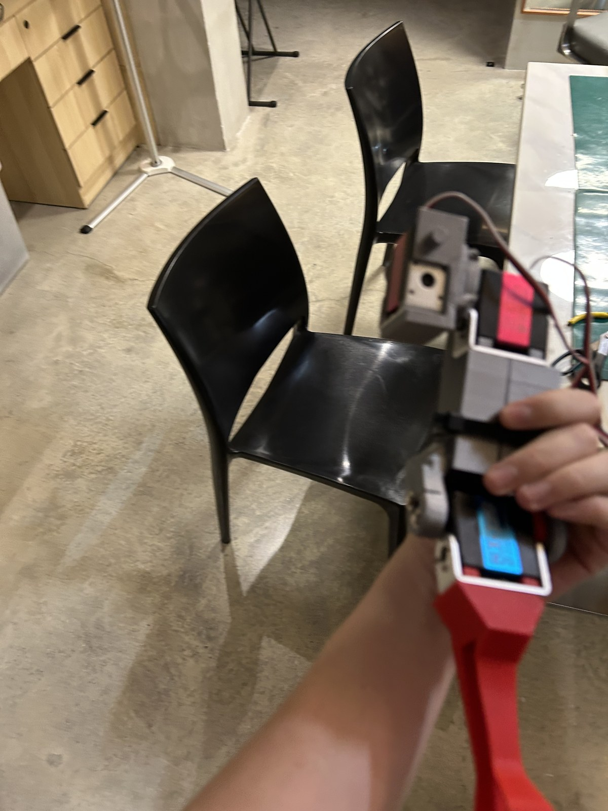
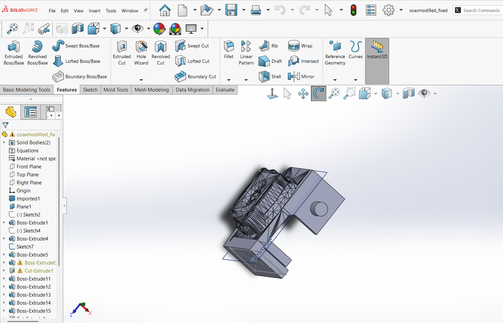
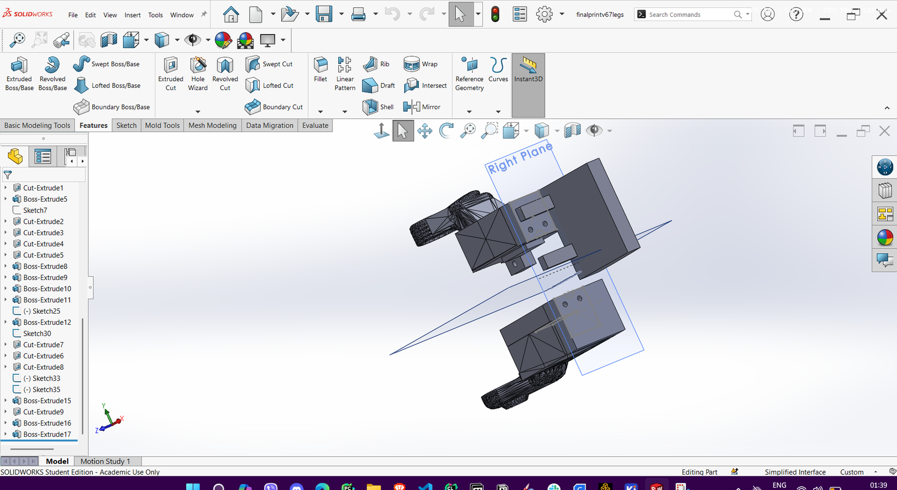
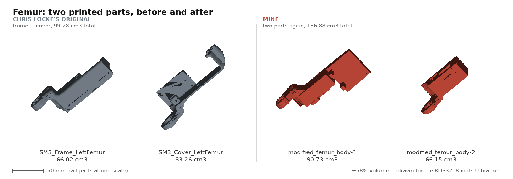
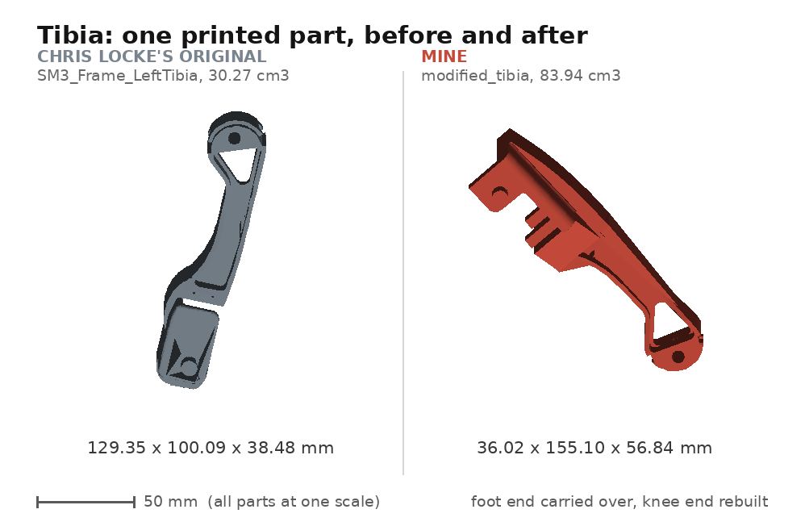
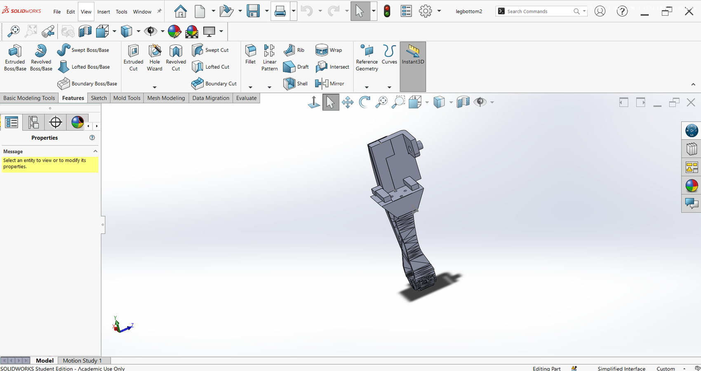
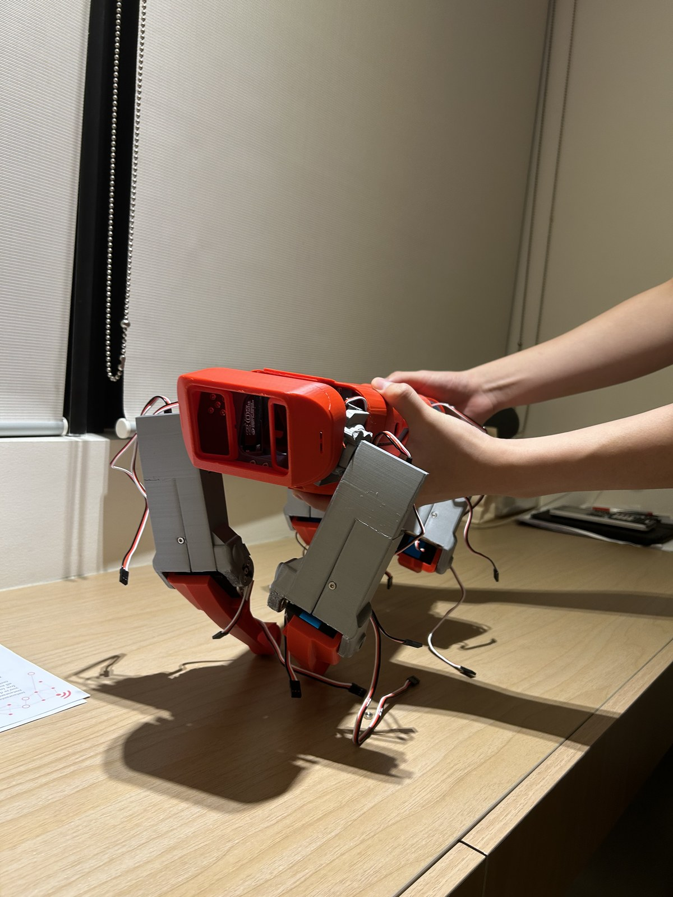

# Mechanical: redesigning the legs around a servo that mounts differently

← [back to the main README](../README.md)

---

## The constraint

The Nova SM3 is drawn around the **DS3218** servo. That servo bolts down through **four
sets of mounting holes**, and every leg part in the original design is built to take it:
pockets sized to the case, bosses positioned under those four hole sets, walls that clamp
around the body.

The only servo I could buy was the **RDS3218**. Electrically and dimensionally it is a
close relative. Mechanically it is not: it has no four-hole pattern. It **hangs in a
U-shaped metal bracket**, and the bracket is how it attaches to anything.

So this was never a case of opening out a hole or shaving a wall. **The entire mounting
scheme the parts were designed around does not exist on the part I had.** Every feature
that held a servo was holding onto something that was no longer there, which meant each
leg part had to be redesigned from scratch.

**The servos, all 270 degrees:**

| Joint | Servo | Torque | Count |
|---|---|---|---|
| Coax (hip) | RDS3218 | 20 kg.cm | 4 |
| Femur (thigh) | RDS3218 | 20 kg.cm | 4 |
| Tibia (knee) | RDS3235 | 35 kg.cm | 4 |

---

## The one thing that could not move

> **Preserve the servo horn interface exactly. Rebuild everything around it.**

The horn is where the joint axis lives. Shift it a few millimetres and every link length
in the leg changes, and the hand-tuned gait multipliers in
[`Gaits.ino`](../firmware/Nova-SM3_teensy-v6.0/Gaits.ino) stop describing the robot. There
is no inverse kinematics in this firmware to absorb that, so the geometry has to be right.

Everything else is structure, and structure can be rebuilt.

---

## How the bracket problem was actually solved

The RDS3218 sits inside its U bracket, which leaves two things to design against:

**1. Two protrusions that slot between the bracket arms.** Rather than trying to clamp the
servo body, the printed part carries two protrusions that locate into the gap between the
U bracket and the servo, so the bracket itself does the holding and the print just captures
it.

**2. Four holes underneath.** The bracket is then fixed down through four holes in the
bottom face of the part.

**3. A clearance cut for the far end.** The RDS3218 has a protrusion on the end opposite
the horn, the mating feature for the other side of the U bracket. That protrusion turned
out to be **axially aligned with the servo horn and with the bearing boss**, which meant a
single extrude cut along that axis cleared it. A piece of luck in the original design's
favour, and the reason that end did not need rebuilding too.

<table>
<tr>
<td width="50%"></td>
<td width="50%"></td>
</tr>
<tr>
<td colspan="2"><em>A complete leg. Grey parts are the coax and the two femur pieces, the
red part is the tibia. The parting line across the grey femur with the tie around it is
the joint between femur body 1 and body 2: like the original, the femur prints as two
pieces. The servos are visible sitting in their brackets.</em></td>
</tr>
</table>

---

## How the parts were modified

The parts are not redrawn from scratch in CAD, and not mesh-edited either. The workflow
was chosen to **preserve geometry that still worked**, in particular the TPU foot mounting
holes, which were among the few original components I could still use:

1. **Tinkercad** for the rough cutting and the crude changes, working directly on the
   original STL. Fast, and good enough to hack away what the new servo made irrelevant
   while leaving the features worth keeping alone.
2. **Formware** to patch the mesh afterwards. Boolean cuts on an STL leave a damaged,
   non-manifold shell, and that has to be repaired before anything downstream will accept
   it. The intermediate file in my working set is still named after this step.
3. **SolidWorks** for the formal parametric work: import the repaired mesh as a base solid
   body, then add real sketches, boss-extrudes and cut-extrudes on top.

That sequence is visible in the feature trees. The coax part opens with `Imported1`,
Chris Locke's geometry, and then carries my own sketches and features on top of it:

<table>
<tr>
<td width="50%"></td>
<td width="50%"></td>
</tr>
<tr>
<td colspan="2"><em>Left, the coax part (<code>coaxmodified_fixed</code>): the tree starts
at <code>Imported1</code> and then runs through Sketch2/4/7, Boss-Extrude1/4/5/11-15 and
Cut-Extrude1, all mine. Right, the femur document
(<code>finalprintv67legs</code>) showing the mirrored pair, with roughly twenty-five sketch
and feature operations behind it.</em></td>
</tr>
</table>

Because the changes are parametric features on an imported body rather than a one-way mesh
edit, a different servo could be accommodated by editing a sketch dimension instead of
starting over.

---

## Part by part

All dimensions and volumes below are **measured from the mesh geometry** of the files in
[`cad/`](cad/), not estimated or recalled.

### Coax (hip bracket)

| | Original `SM3_Frame_LeftCoax` | Mine `modified_coax` | Change |
|---|---|---|---|
| Envelope | 37.59 x 46.13 x 57.50 mm | 37.45 x 49.77 x 57.97 mm | +3.64 mm across |
| Volume | 23.88 cm3 | 26.21 cm3 | +9.8% |

**The envelope along the joint axis changes by 0.14 mm.** That is the horn interface being
held. The 3.64 mm of growth is all transverse, which is the pocket opening up for a servo
in a bracket.

Structurally the original's full-height flat back plate with an overhanging two-hole ear
becomes a stepped C-bracket: a narrow vertical web, a broad cantilevered top shelf, and a
separate lower foot with a boss.

Looking straight down the joint axis makes the point in one image: **same five-hole horn
pattern, completely different pocket.**

### Femur (two printed parts, before and after)

The original femur is **two printed parts that bolt together**, a structural frame and a
cover. Mine is also two parts. Nothing was merged; the split was kept because it works and
because it makes the part printable.

| | Original | Mine |
|---|---|---|
| Part 1 | `SM3_Frame_LeftFemur`, 66.02 cm3 | `modified_femur_body-1`, 90.73 cm3 |
| Part 2 | `SM3_Cover_LeftFemur`, 33.26 cm3 | `modified_femur_body-2`, 66.15 cm3 |
| **Assembly total** | **99.28 cm3** | **156.88 cm3** |

**+58% volume.** That is the honest cost of the substitution: the RDS3218 in its U bracket
is a physically larger thing to carry than a DS3218 bolted through four holes, and the
structure around it grew accordingly.

Both parts are on one plate in
[`modified_femur_plate.stl`](cad/modified/modified_femur_plate.stl), which is the file that
was actually printed. `modified_femur_body-1.stl` and `modified_femur_body-2.stl` are those
same two bodies separated out so each can be inspected or printed on its own. The geometry
is untouched; only the file container differs.

### Tibia (one printed part)

| | Original `SM3_Frame_LeftTibia` | Mine `modified_tibia` |
|---|---|---|
| Envelope | 129.35 x 100.09 x 38.48 mm | 36.02 x 155.10 x 56.84 mm |
| Volume | 30.27 cm3 | 83.94 cm3 |
| Triangles | 4,332 | 3,032 |

The tibia is a **single printed part** in both designs. The original is a slim curved arm
with a knee bore at one end and a light bracket at the other. Mine keeps the curved lower
arm, the triangular lightening cutout and **the whole foot end with its TPU foot mounting**,
and replaces the light knee bracket with a full enclosure for the 35 kg.cm RDS3235.

That foot end being carried across is the Tinkercad step paying off: it was worth preserving
exactly, so it was cut around rather than redrawn.

*The tibia in SolidWorks (`legbottom2`). The boxy knee-end servo enclosure is new; the
tapering lower arm and foot end below it come from the original.*

---

## Printing and first assembly

*The printed structure assembled for the first time, before any electronics. Red tibias,
grey femurs and coax brackets.*

---

## Files

### [`cad/original/`](cad/original/): Chris Locke's, unmodified

Kept under his filenames, byte-for-byte as published, and never edited in place. Only the
parts with a modified counterpart are mirrored here.

| File | Triangles | Envelope (mm) | Volume |
|---|---|---|---|
| `SM3_Frame_LeftCoax.stl` | 3,464 | 37.59 x 46.13 x 57.50 | 23.88 cm3 |
| `SM3_Frame_LeftFemur.stl` | 22,192 | 138.54 x 51.09 x 34.66 | 66.02 cm3 |
| `SM3_Cover_LeftFemur.stl` | 12,920 | 156.79 x 55.47 x 40.45 | 33.26 cm3 |
| `SM3_Frame_LeftTibia.stl` | 4,332 | 129.35 x 100.09 x 38.48 | 30.27 cm3 |

### [`cad/modified/`](cad/modified/): mine

Both the STL and the native SolidWorks part, so the geometry stays re-editable.

| File | Triangles | Envelope (mm) | Volume | Is |
|---|---|---|---|---|
| `modified_coax.stl` | 3,406 | 37.45 x 49.77 x 57.97 | 26.21 cm3 | hip bracket |
| `modified_femur_body-1.stl` | 5,370 | 147.13 x 68.49 x 35.66 | 90.73 cm3 | femur, part 1 |
| `modified_femur_body-2.stl` | 5,608 | 99.64 x 37.52 x 38.52 | 66.15 cm3 | femur, part 2 |
| `modified_femur_plate.stl` | 10,978 | 149.64 x 109.99 x 38.52 | 156.88 cm3 | both femur bodies, as printed |
| `modified_tibia.stl` | 3,032 | 36.02 x 155.10 x 56.84 | 83.94 cm3 | knee to foot, one piece |

The native SolidWorks parts are alongside them: `modified_coax.SLDPRT`,
`modified_femur_plate.SLDPRT` and `modified_tibia.SLDPRT`. These are the re-editable
versions; the STLs are exports.

### [`cad/modified/solidworks/`](cad/modified/solidworks/)

Screenshots of the models and their feature trees, which is where the provenance is
visible.

| Screenshot | Document | Shows |
|---|---|---|
| `coax-solidworks-tree.png` | `coaxmodified_fixed` | `Imported1` at the top of the tree, then my sketches and extrudes on top of it |
| `femur-mirrored-pair.png` | `finalprintv67legs` | the femur bodies as a mirrored left/right pair |
| `femur-feature-tree.png` | `finalprintv67legs` | the same document's full feature list, roughly twenty-five operations |
| `tibia-solidworks.png` | `legbottom2` | the tibia, new knee enclosure above the original lower arm |

### [`cad/comparisons/`](cad/comparisons/)

Rendered directly from the STL files above at a single shared scale, with the measured
numbers printed on the figure. Nothing here is drawn by hand and all of it regenerates from
the geometry alone.

---

## What is not documented here

A portfolio that only shows what went well is not worth much:

- **No dimensioned drawings.** These are rendered comparisons and measured envelopes, not a
  drawing package with tolerances.
- **No print settings or material record.** Layer height, infill, material and orientation
  were not logged, and I am not going to reconstruct them from memory.
- **No load analysis.** Parts were sized by judgement and iteration, not by FEA or by
  measured joint torque. The 35 kg.cm servo at the knee was chosen because the knee carries
  the most load, not from a calculation.
- **Only the left-side parts are archived here.** The right-side parts are mirrors, visible
  in the `finalprintv67legs` document but not exported separately into this set.

---

## Licence

`cad/original/` is Chris Locke's work under the upstream project's terms. `cad/modified/`
is derived from it and carries the same obligations. If you use either, credit
[novaspotmicro.com](https://novaspotmicro.com).
